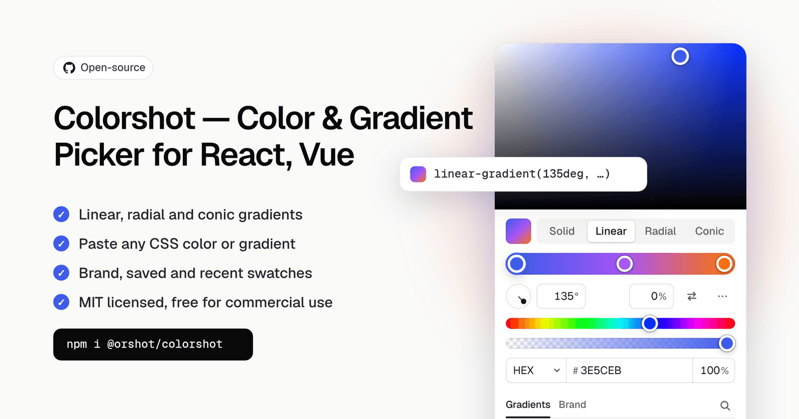

<div align="center"><strong>Colorshot</strong></div>
<div align="center">Color and gradient picker for React and Vue.<br />Solid colors, linear, radial and conic gradients, swatch groups, one package.</div>
<br />
<div align="center">
<a href="https://orshot.com/open-source/colorshot">Docs and live demos</a>
<span> · </span>
<a href="https://www.npmjs.com/package/@orshot/colorshot">npm</a>
<span> · </span>
<a href="llms.txt">llms.txt</a>
</div>

## Introduction

Colorshot is the color picker inside [Orshot Studio](https://orshot.com), open sourced. It takes any CSS color or gradient string and gives one back, so it fits whatever your app already stores. It never throws on input it cannot read, and the parts of a value you did not edit come back exactly as written.

- Solid colors with hue, saturation, alpha, eyedropper and hex / rgb / hsl / oklch input
- Linear, radial, conic and repeating gradients with draggable stops, an angle dial and a center pad
- Paste any CSS color or gradient with Cmd/Ctrl+V, copy with Cmd/Ctrl+C
- Your own swatch groups: brand, saved, recent, with search, add, remove, reorder and rename
- A ready-made `ColorPicker`, a `ColorField` that opens it in a popover, or headless parts to build your own layout
- Keyboard, screen reader, touch and two-finger trackpad support
- React and Vue from one framework-free core, themed with CSS variables

## Install

```sh
npm i @orshot/colorshot
```

## Getting started

```tsx
"use client";

import { useState } from "react";
import { ColorPicker } from "@orshot/colorshot/react";
import "@orshot/colorshot/styles.css";

export function FillPicker() {
  const [fill, setFill] = useState("linear-gradient(135deg, #3E5CEB 0%, #22C55E 100%)");

  return (
    <ColorPicker
      value={fill}
      onChange={setFill} // every frame while dragging
      onChangeComplete={(value) => save(value)} // once, when the change is done
    />
  );
}
```

Vue:

```vue
<script setup>
import { ref } from "vue";
import { ColorPicker } from "@orshot/colorshot/vue";
import "@orshot/colorshot/styles.css";

const fill = ref("#3E5CEB");
</script>

<template>
  <ColorPicker v-model="fill" @change-complete="save" />
</template>
```

## Examples

Live versions of every example: https://orshot.com/open-source/colorshot#linear

### Linear, radial or conic gradient only

One mode hides the tabs. `value` is any CSS gradient, and the picker writes one back.

```tsx
<ColorPicker value={value} onChange={setValue} modes={["linear"]} />
// value: "linear-gradient(90deg, #22C55E 0%, #3E5CEB 100%)"

<ColorPicker value={value} onChange={setValue} modes={["radial"]} />
// value: "radial-gradient(circle at 30% 30%, #FDE68A 0%, #F97316 45%, #BE123C 100%)"

<ColorPicker value={value} onChange={setValue} modes={["conic"]} />
// value: "conic-gradient(from 0deg at 50% 50%, #EF4444, #F59E0B, #22C55E, #3B82F6, #A855F7, #EF4444)"
```

Repeating gradients (`repeating-linear-gradient(...)` and the rest) work the same way; toggle Repeating in the `...` menu.

### Gradients only

For backgrounds that must be a gradient. `defaultGradient` is what a solid value turns into.

```tsx
<ColorPicker
  value={value}
  onChange={setValue}
  modes={["linear", "radial", "conic"]}
  defaultGradient="linear-gradient(90deg, #3E5CEB 0%, #22C55E 100%)"
  gradientPresets
/>
```

### Solid colors, no transparency

```tsx
<ColorPicker value={value} onChange={setValue} modes={["solid"]} alpha={false} formats={["hex", "rgb", "hsl"]} />
```

### Text color with a contrast check

Shows the WCAG ratio and draws the AA line on the color area.

```tsx
<ColorPicker value={value} onChange={setValue} modes={["solid"]} alpha={false} contrastWith="#FFFFFF" />
```

### OKLCH and wide gamut

```tsx
<ColorPicker
  value={value} // "oklch(0.62 0.2 265)"
  onChange={setValue}
  modes={["solid"]}
  space="oklch"
  formats={["oklch", "hex", "rgb"]}
  outputFormat="oklch"
/>
```

### Undo and before / after

```tsx
<ColorPicker value={value} onChange={setValue} history compare />
```

### Saving changes

`onChange` fires on every frame of a drag. Update the preview there, and save in `onChangeComplete`, which fires once.

```tsx
<ColorPicker
  value={layer.fill}
  onChange={(fill) => updateLayerPreview(layer.id, { fill })}
  onChangeComplete={(fill) => saveLayer(layer.id, { fill })}
/>
```

### In a form

`ColorField` takes a value and an onChange like an input, so it works with any form library:

```tsx
import { Controller, useForm } from "react-hook-form";
import { ColorField } from "@orshot/colorshot/react";

const { control, handleSubmit } = useForm({ defaultValues: { accent: "#3E5CEB" } });

<Controller
  name="accent"
  control={control}
  render={({ field }) => (
    <ColorField label="Accent" value={field.value} onChange={field.onChange} modes={["solid"]} alpha={false} />
  )}
/>;
```

### Match a stored format

Keep whatever format your app already stores. Here: uppercase hex when opaque, comma `rgba()` otherwise.

```tsx
import { formatColor } from "@orshot/colorshot";

const outputFormat = (color) =>
  color.alpha >= 1
    ? formatColor({ ...color, alpha: 1 }, "hex", { upper: true })
    : formatColor(color, "rgb", { legacy: true, fn: "rgba" });

<ColorPicker value={value} onChange={setValue} outputFormat={outputFormat} />;
```

### shadcn/ui theme

```css
/* globals.css. On shadcn/ui v3 (HSL channel tokens) wrap them: hsl(var(--primary)) */
[data-colorshot],
[data-colorshot-field] {
  --cs-accent: var(--primary);
  --cs-bg: var(--popover);
  --cs-fg: var(--popover-foreground);
  --cs-border: var(--border);
  --cs-radius: var(--radius);
}
```

## Using with AI

Install the Colorshot skill to teach your coding agent (Claude Code, Codex, Cursor, GitHub Copilot and others) how to add and configure the picker:

```sh
npx skills add rishimohan/colorshot
```

The API reference is also available for LLMs in [llms.txt](llms.txt), and the docs page has a setup prompt you can copy into any agent.

## One package

| Import | What it is |
| --- | --- |
| `@orshot/colorshot/react` | React components and composable parts |
| `@orshot/colorshot/vue` | Vue components and composable parts |
| `@orshot/colorshot` | Framework-free helpers: color math, CSS gradient parsing, contrast, gradient handles, the picker store. Safe in server code |
| `@orshot/colorshot/styles.css` | The stylesheet, imported once |

Apps only bundle what they import: a React app never pulls in the Vue code, and React and Vue are optional peer dependencies.

## Optional features

All off unless you turn them on.

| Prop | What it does |
| --- | --- |
| `space="oklch"` | OKLCH area (lightness × chroma at one hue, drawn in Display P3 where supported, dashed line marks the sRGB edge) and a perceptual hue slider |
| `history` | Undo / redo committed changes with Cmd/Ctrl+Z inside the picker |
| `swatchSearch` | Search box that filters every swatch group by name, value or hex |
| `gradientPresets` | Gradient swatches shown in gradient modes (`true` or your own list) |
| `contrastWith="#fff"` | WCAG contrast badge against a background; gradients use their weakest stop |
| `tabIcons` | Icons next to the Solid / Linear / Radial / Conic labels |
| `compare` | Before / after swatch beside the sliders; click "before" to restore |
| `swatchLayout="stack"` | List every swatch group instead of one tab per group |
| `size="sm"` | Compact: 240px wide, 24px controls |
| `variant="inset"` | Mode tabs first and a framed area, instead of the default edge-to-edge area |
| `shortcuts={false}` | Turn off 1-4 (modes) and I (eyedropper) |
| `storageKey={null}` | Keep recent colors, the chosen format and swatch tab in memory only |
| `swatches=[...]` | Swatch groups with `onAdd` / `onRemove`, `limit`, `recent: true`, `showIn` |
| `eyeDropper={fn}` | Your own screen picker for browsers without the native EyeDropper |

Always on, no props needed:

- Cmd/Ctrl+C copies the value and Cmd/Ctrl+V applies a pasted color or gradient while the picker has focus
- Two-finger trackpad swipes move the area, sliders, stops and angle dial (the page still scrolls when the swipe started elsewhere)
- Alt-drag a stop to duplicate it, drag a stop off the bar or press Delete to remove it, drag a solid swatch onto the bar to add it
- Switching between solid and gradient keeps the color you are editing on the active stop
- Touch screens get larger thumbs and targets

## ColorField

A trigger that opens the picker in a popover. Flips and shifts to stay on screen, closes on Escape, outside click or tab-away, and returns focus to the trigger. Takes every `ColorPicker` prop.

```tsx
import { ColorField } from "@orshot/colorshot/react";

<ColorField label="Fill" value={fill} onChange={setFill} gradientPresets history />;
```

## On-canvas gradient handles

Framework-free helpers for drawing gradient handles on your own canvas:

```ts
import { gradientHandles, moveGradientHandle } from "@orshot/colorshot";

const result = gradientHandles(value, width, height); // null when value is not a gradient
if (result) {
  const { handles, line } = result; // start / end / stops / center / angle
  const next = moveGradientHandle(value, handles[0].id, x, y, width, height, { snap: shiftKey });
}
```

## API reference

### ColorPicker props

`ColorPicker` (React) and `<ColorPicker>` (Vue, with `v-model` and `@change-complete`) take the same props.

| Prop | Type | Default | What it does |
| --- | --- | --- | --- |
| `value` | `string` | | Any CSS color or gradient. Unknown text is shown as unsupported and left as it is |
| `defaultValue` | `string` | | Uncontrolled starting value |
| `onChange` | `(value: string) => void` | | Fires while dragging or typing, at most once per frame |
| `onChangeComplete` | `(value: string) => void` | | Fires once when a change ends (pointer up, input commit, swatch click). Save and record undo here |
| `modes` | `PickerMode[]` | all four | Any of `"solid"`, `"linear"`, `"radial"`, `"conic"`. One mode hides the tabs |
| `outputFormat` | `OutputFormat` | `"preserve"` | `"preserve"` keeps each color's format; or a format name (`"hex"`, `"rgb"`, `"oklch"`, ...); or `(color, source) => string` |
| `defaultColor` | `string` | | The color a gradient turns into when switched to solid |
| `defaultGradient` | `string` | | The gradient a solid color turns into when switched to a gradient mode |
| `alpha` | `boolean` | `true` | Opacity slider and field |
| `formats` | `DisplayFormat[]` | hex, rgb, hsl, oklch | Formats in the input menu: `hex`, `rgb`, `hsl`, `hsb`, `oklch`, `oklab`, `lch`, `lab`, `p3`, `cmyk` |
| `defaultFormat` | `DisplayFormat` | from the value | Starting format in the input menu |
| `inputs` | `boolean` | `true` | Show the format menu and channel fields |
| `eyeDropper` | `boolean \| EyeDropperFn` | `true` | Native EyeDropper where it exists; pass a function for other browsers; `false` hides it |
| `swatches` | `SwatchGroupConfig[]` | | Swatch groups (see below) |
| `swatchSearch` | `boolean` | `false` | Search box over every swatch group |
| `swatchLayout` | `"tabs" \| "stack"` | `"tabs"` with 2+ groups | One tab per group, or every group listed |
| `gradientPresets` | `boolean \| string[]` | `false` | Gradient swatches in gradient modes: the built-in set or your own |
| `interpolation` | `boolean` | `true` | Color blending menu (`in oklch` and others) for gradients |
| `contrastWith` | `string` | | WCAG contrast badge and AA line against this background |
| `compare` | `boolean` | `false` | Before / after swatch; click "before" to restore |
| `history` | `boolean \| { limit?: number }` | `false` | Undo / redo with Cmd/Ctrl+Z inside the picker |
| `space` | `"hsv" \| "oklch"` | `"hsv"` | Color model of the area and hue slider |
| `tabIcons` | `boolean` | `false` | Icons next to the mode labels |
| `theme` | `"light" \| "dark"` | follows the OS | Force a theme |
| `size` | `"sm"` | | Compact: 240px wide, 24px controls |
| `variant` | `"bleed" \| "inset"` | `"bleed"` | Edge-to-edge area, or mode tabs first and a framed area |
| `shortcuts` | `boolean` | `true` | 1-4 switch modes, I opens the eyedropper (while the picker has focus) |
| `storageKey` | `string \| null` | `"colorshot"` | localStorage prefix for recent colors and the chosen format; `null` keeps them in memory |
| `labels` | `Partial<Labels>` | English | Override any visible or screen reader text |
| `className`, `style` | | | On the root element; set `--cs-*` variables through `style` |

### Swatch groups

```ts
interface Swatch {
  value: string;
  label?: string; // shown as a tooltip
  id?: string; // your id, passed back to onRemove
}

interface SwatchGroupConfig {
  id: string;
  label?: ReactNode; // the group's tab name
  colors?: (string | Swatch)[] | "default"; // "default" is the built-in palette
  recent?: boolean; // recently used colors, stored under storageKey
  limit?: number; // show at most this many, with a "Show all" toggle
  showIn?: "solid" | "gradient"; // only show the group in one kind of mode
  onAdd?: (value: string) => void; // shows a + button that saves the current value
  onRemove?: (swatch: Swatch) => void; // remove button on hover, Delete on a focused swatch
  onReorder?: (swatches: Swatch[]) => void; // drag (or Alt + arrows) to reorder
  onRename?: (swatch: Swatch, label: string) => void; // double-click or F2
  renderSwatch?: (swatch: Swatch, state: { selected: boolean }) => ReactNode;
  emptyText?: ReactNode; // shown when the group is empty
}
```

### ColorField props

Every `ColorPicker` prop, plus:

| Prop | Type | What it does |
| --- | --- | --- |
| `label` | `string` | Accessible name of the trigger, e.g. "Fill" |
| `placeholder` | `string` | Text when the value is empty |
| `placement` | `"bottom-start" \| "bottom-end" \| "top-start" \| "top-end" \| "right-start" \| "left-start"` | Preferred side (default `bottom-start`). It flips and shifts to stay on screen |
| `offset` | `number` | Gap between the trigger and the picker in px (default 6) |
| `open`, `defaultOpen`, `onOpenChange` | `boolean`, `(open) => void` | Control the popover, or leave it uncontrolled |
| `portal` | `boolean \| HTMLElement \| null` | Render in a portal on `document.body` (default) or inside an element; `false` renders inline |
| `disabled` | `boolean` | Disable the trigger |
| `renderTrigger` | `({ value, open }) => ReactNode` | Your own trigger contents |
| `pickerClassName`, `pickerStyle` | `string`, `CSSProperties` | Style the picker inside the popover |

A ref gives you `{ open(), close(), trigger }`.

### Parts

For your own layout, compose parts under `Picker.Root` (it takes the value props above):

| Part | What it is |
| --- | --- |
| `Root` | The panel and the state every other part reads |
| `Area` | The 2D color area |
| `Hue`, `Alpha` | Hue and opacity sliders |
| `ModeTabs` | Solid, Linear, Radial and Conic tabs |
| `GradientEditor` | Bar plus controls, shown only in gradient modes |
| `GradientBar` | The stop bar on its own |
| `GradientControls`, `AngleDial`, `CenterPad` | Angle, shape, size and center controls |
| `Inputs` | Format menu and channel fields |
| `EyeDropper` | Screen color picking where the browser supports it |
| `Swatches` | Swatch groups with tabs, search, add and remove |
| `CurrentSwatch`, `Preview` | The current value, with an optional before and after |
| `Contrast` | WCAG contrast badge against a background |
| `Notice` | Shown when a value cannot be read |

```tsx
import { Picker } from "@orshot/colorshot/react";

<Picker.Root value={value} onChange={setValue}>
  <Picker.Area />
  <Picker.Hue />
  <Picker.Alpha />
  <Picker.Inputs />
  <Picker.Swatches groups={groups} />
</Picker.Root>;
```

### Theming

Set CSS variables on any parent or on the picker. Styles live in `@layer colorshot`, so your own unlayered CSS (Tailwind utilities included) wins without `!important`.

| Variable | What it sets |
| --- | --- |
| `--cs-accent` | Focus rings and selected states |
| `--cs-bg`, `--cs-fg` | Panel background and text |
| `--cs-border`, `--cs-divider` | Borders and dividers |
| `--cs-radius`, `--cs-radius-control` | Panel and control corners |
| `--cs-width`, `--cs-padding`, `--cs-gap` | Panel size and spacing |
| `--cs-area-height` | Height of the color area |
| `--cs-swatch-columns` | Swatches per row |
| `--cs-shadow` | Panel shadow |
| `--cs-font-size` | Base text size |
| `--cs-motion` | Transition length (motion is off under `prefers-reduced-motion`) |

```css
.inspector [data-colorshot] {
  --cs-accent: #3e5ceb;
  --cs-width: 100%;
  --cs-area-height: 160px;
}
```

The documented `--cs-*` variables, `data-part` names and the `data-state`, `data-mode`, `data-theme`, `data-size` and `data-variant` attributes follow semver.

### Localization

Every visible and screen reader string is a label. `{placeholders}` are filled in for you.

```tsx
<ColorPicker
  value={value}
  onChange={setValue}
  labels={{
    picker: "Farbwähler",
    solid: "Einfarbig",
    linear: "Linear",
    radial: "Radial",
    conic: "Konisch",
    hue: "Farbton",
    alpha: "Deckkraft",
    stopName: "Farbstopp {index} von {count}",
  }}
/>
```

### Keyboard and gestures

| Input | What it does |
| --- | --- |
| Two-finger swipe | Move the area, sliders, stops and angle on a trackpad |
| Arrow keys | Nudge the focused thumb, stop or field (Shift for 10x) |
| `1` to `4` | Switch Solid, Linear, Radial and Conic (picker focused) |
| `I` | Open the eyedropper |
| Cmd/Ctrl+C, Cmd/Ctrl+V | Copy the value, or paste any CSS color or gradient |
| Cmd/Ctrl+Z, Shift+Cmd/Ctrl+Z | Undo and redo, with the `history` prop |
| Click the bar, Enter | Add a stop |
| Alt + drag a stop | Copy the stop |
| Drag off the bar, Delete | Remove a stop |
| Drag a swatch onto the bar | Add it as a stop |
| Escape | Drop what you typed, or close a ColorField |

### Core helpers

`@orshot/colorshot` has no framework code and is safe in server code.

| Helper | What it does |
| --- | --- |
| `createPicker(options)` | The framework-free store the React and Vue pickers use |
| `parseColor(css)` | Any CSS color to `{ color, format }`, or `null`. Never throws |
| `formatColor(color, format, style?)` | Write a color as hex, rgb, hsl, oklch, p3 and more |
| `convert`, `toSrgb`, `inGamut`, `toGamut` | Color space conversion and gamut mapping |
| `isGradient`, `parseGradient`, `serializeGradient` | Read and write CSS gradients, keeping what you did not edit |
| `gradientAngle`, `gradientCenter` | Read a gradient's angle and center |
| `gradientHandles`, `moveGradientHandle` | Start, end, stop and center handles for your own canvas |
| `contrastRatio(fg, bg)`, `contrastLevel(ratio)`, `luminance` | WCAG contrast and its AA or AAA level |
| `isSafeCssValue`, `safeCssValue` | Only plain colors and gradients, before a stored value reaches a style |

```ts
import { parseColor, formatColor, contrastRatio, isSafeCssValue } from "@orshot/colorshot";

formatColor(parseColor("#3366ff")!.color, "oklch"); // "oklch(0.5726 0.2338 265.28)"
contrastRatio("#64748b", "#ffffff"); // 4.76
isSafeCssValue(storedValue); // validate stored values before writing them into HTML or CSS
```

### TypeScript

Types ship with the package, for every entry.

```ts
import type { ColorPickerProps, ColorFieldProps, SwatchGroupConfig, Swatch, DisplayFormat } from "@orshot/colorshot/react";
import type { OutputFormat, PickerMode, Color } from "@orshot/colorshot";
```

### Next.js and SSR

The React entry is marked `"use client"`: render the components from client components, and import helpers from `@orshot/colorshot` in server code. The picker renders the same markup on the server and the client. Pass `theme` from your theme provider after hydration, or leave it unset to follow the OS.

### Accessibility

- Checked with axe against WCAG 2.2 AA in the browser test suite
- Every slider, stop and field is keyboard reachable, and sliders announce their value in words through `aria-valuetext`
- Screen reader labels for every control, all overridable through `labels`
- High contrast (`forced-colors`), right-to-left layouts and `prefers-reduced-motion` are supported
- Touch screens get larger thumbs and targets

### Browser support

Current Chrome, Edge, Firefox and Safari. The browser tests run in Chromium, Firefox and WebKit. The eyedropper uses the native EyeDropper API where it exists (Chromium) and hides itself elsewhere, unless you pass `eyeDropper={fn}`.

## Development

```sh
pnpm install
pnpm --filter @colorshot/playground dev       # playground on http://localhost:5190
pnpm --filter @colorshot/core test            # parser, conversion and gradient corpus tests
pnpm --filter @colorshot/playground test:e2e  # browser tests on Chromium, Firefox and WebKit
pnpm build && pnpm size                       # build everything and check gzip budgets
```

See [CONTRIBUTING.md](CONTRIBUTING.md) for the layout and the rules, and [RELEASING.md](RELEASING.md) for publishing.

## License

MIT. Free for personal and commercial use: keep the copyright line and license text, which link to https://orshot.com/open-source/colorshot. The color conversion matrices come from CSS Color Module Level 4, see [THIRD-PARTY-NOTICES.md](THIRD-PARTY-NOTICES.md).

---

Brought to you by [Orshot](https://orshot.com), the API for automated image, PDF and video generation from templates. MIT License.
